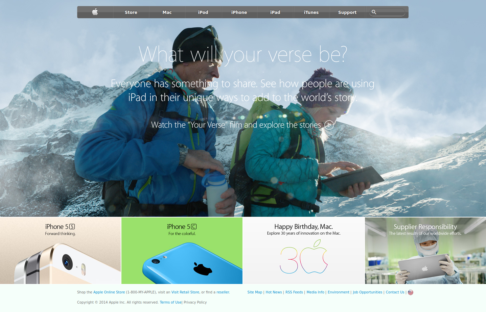

# Building With Backgrounds and Gradients

> Solo Microverse/The Odin Project project - consists of building a webpage using images as a background and adding gradients to elements. It is a clone of an older version of Apple's website page.

You can find the original project page here: (https://web.archive.org/web/20140301004610/http://www.apple.com/)

This project used CSS flex to build most of the page.

## Built With

- CSS Flex,
- HMTL.

## Live Demo

[Live Demo Link](https://livedemo.com)

## Authors

👤 **Guilherme Recordon**

- Github: [@guirecordon](https://github.com/guirecordon)
- Twitter: [@RecordonG](https://twitter.com/RecordonG)
- Linkedin: [Guilherme Recordon](https://linkedin.com/gui-recordon-marketingmba/)

## 🤝 Contributing

Contributions, issues and feature requests are welcome!

Feel free to check the [issues page](issues/).

## Show your support

Give a ⭐️ if you like this project!
